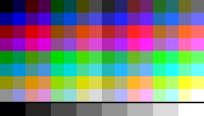

# tile2sam

Converts tiled SAM Coupé graphics from an image file to a linear data format typically needed by drawing routines.

## Prerequisites

- Python 2.7.x or 3.x (or later) in your path [[Windows download](https://www.python.org/downloads/windows/)]
- Pillow module for Python

If you have *Python* installed but not *Pillow*, you can install it using:
```
pip install pillow
```

## Command-line Options

```
usage: tile2sam.py [-h] [-m MODE] [-c CLUT] [-o OUTPUT] [-p] [-i] [-t TILES]
                   [-q] [--crop CROP] [--scale SCALE] [--shift SHIFT]
                   image tilesize

Extracts tiled SAM graphics data from an image file.

positional arguments:
  image
  tilesize

optional arguments:
  -h, --help            show this help message and exit
  -m MODE, --mode MODE  output data screen mode (1-4) (default: 4)
  -c CLUT, --clut CLUT  custom colour file or list (default: None)
  -o OUTPUT, --output OUTPUT
                        custom output data file (default: None)
  -p, --pal             write clut to .pal file (default: False)
  -i, --index           write offsets index to .idx (default: False)
  -t TILES, --tiles TILES
                        tile count or list of ranges (N-M) (default: None)
  -q, --quiet           quiet mode (default: False)
  --crop CROP           crop region (WxH or WxH+X+Y) (default: None)
  --scale SCALE         scale region (S or HxV) (default: None)
  --shift SHIFT         pixels to shift right (default: 0)
  ```

## Required Arguments

> image

An image file containing the graphics data. Most image file formats are [supported](https://pillow.readthedocs.io/en/stable/handbook/image-file-formats.html), but it's recommended you use an efficient lossless format such as [PNG](https://en.wikipedia.org/wiki/Portable_Network_Graphics).

Image colours are mapped to the nearest SAM palette colour, without any dithering. Images with too many source colours may be rejected. Typically you'll want to author graphics directly using the original SAM palette colours:

<p align="center">
  
</p>

Tiles are extracted starting from the top-left of the image. Use the ```--crop``` and ```--scale``` options to limit the area of interest. Use ```--tiles``` to select the tiles of interest, and the order they're extracted. The extracted graphics may also be pre-shifted using ```--shift```.

> tilesize

Specifies the dimensions of the tiles to extract, in pixels. If a single value ```N``` is given it's treated as having a size of ```NxN```. If both dimensions are specified they should be in the format ```WxH```.

If the tile width does not result in an exact number of output bytes, the right edge is padded with zero pixels. To be aligned to byte boundaries, mode 4 tile width should be a multiple of 2, mode 3 a multiple of 4, and modes 1 and 2 a multiple of 8.

## Optional Arguments

> ```-m MODE, --mode MODE```

Selects the SAM screen mode (1 to 4) used for both output data format and colour selection. Modes 1 and 2 are produce the same 1-bit format, with only 2 colours. Mode 3 is a 2-bit mode with 4 colours. Mode 4 is a 4-bit mode with 16 colours.

The default screen mode is 4.

> ```-c CLUT, --clut CLUT```

Specifies either a comma-separated list of colours, or the name of a ```.pal``` file containing the palette. Each colour should be in the range 0-127.

A complete palette is not required, but those specified will be assigned to the first CLUT slots. Any additional colours required by the image will be automatically assigned to later positions. The final CLUT size must be within the limit for the screen mode (sixteen colours for mode 4, four colours for mode 3, and two colours for modes 1 and 2).

The default behaviour generates a palette from the colours found in the image.

> ```-o OUTPUT, --output OUTPUT```

Specify a custom output file for the .dat content. The same basename is also used for ```.pal``` and ```.idx``` files if they are enabled.

The default behaviour uses the basename of the input image, so ```image.png``` will generate ```image.dat```.

> ```-p, --pal```

Write the corresponding palette to a ```.pal``` file, which is a binary file containing 1 byte per colour. The palette file may then be used as an input file using the ```--clut``` option.

The default behaviour displays the list of colours to the console but does not save it to a file.

> ```-i, --index```

Generate an index of data offsets to each output tile. Each entry is a 16-bit value in little-endian format. While the entries are simple multiples of the tile data size, multiple index files from different invocations may be combined to give a more useful look-up table.

The default behaviour is not to output an index.

> ```-t TILES, --tiles TILES```

Selects the tiles to extract from the image. If a single value is given it's treated as a count of tiles to extract from the top-left of the image. You may also specify a comma-separated list of tile numbers, which can include ranges of tiles in an A-B (inclusive) notation. If the range start is greater than the end that portion is extracted in reverse order.

The default behaviour is to extract as many complete tiles from the image as possible.

> ```-q, --quiet```

Suppress the output statistics shown at the end of the extraction. Error messages are always shown.

> ```--crop CROP```

Crop the input image so tiles are only extracted from a specific portion of it. The crop region can be just a size in WxH format, or a size and a top-left coordinate in WxH+X+Y format. Cropping is performed before any scaling (see below).

The default behaviour is not to crop the input image.

> ```--scale SCALE```

Scale the input image before extraction, which is useful for pixel-doubled and mode 3 content. Scaling uses a nearest neighbour pixel matching, and is performed after any cropping (see above).

The default behaviour is not to scale the input image.

> ```--shift SHIFT```

Specifies the number of pixels to shift each tile to the right in the output data. This will add padding to the left of the data, and may also result in additional alignment padding to the right. All padding uses CLUT entry zero, which will usually be black.

Please note that shifting output may increase the byte width of the output data. The final tile pixel size (including padding) is reported in the output statistics after conversion. This option can be used to create pre-shifted versions of graphics for optimised drawing routines.

The default behaviour is not to shift content.

## Examples

Extract all 16x16 tiles from ```sprites.png```, write the graphics data to ```sprites.bin``` and palette to ```sprites.pal```:

```
tile2sam.py --pal sprites.png 16x16
```

Extract the first 100 6x6 tiles from ```tiles.png```, using the colours from ```sprites.pal```:

```
tile2sam.py --clut sprites.pal --tiles 100 tiles.png 6x6
```

Extract a non-contiguous selection of 6x6 tiles from ```tiles.png```:

```
tile2sam.py --tiles 10-19,99-90,42 tiles.png 6
```

Extract a 6x8 1-bit font from ```font.png```, write the data to ```font.bin```:
```
tile2sam.py --mode 2 font.png 6x8
```

Extract a 6x8 1-bit font from ```font.png```, shifting the data 2 positions to right-align it, then write to ```font_centre.bin```:
```
tile2sam.py --mode 2 --shift 2 -o font_centre.bin font.png 6x8
```

Extract all 12x12 sprites from ```sprites.png```, fixing only the first 4 CLUT colours so the rest are automatically assigned:
```
tile2sam.py --clut 0,127,25,126 sprites.png 12
```

Extract a mode 4 screen from a 576x480 SimCoupe screenshot to ```mode4.bin``` and ```mode4.pal```:
```
tile2sam.py --crop 512x384+32+48 --scale 0.5 --pal mode4.png 256x192
```

Extract a mode 3 screen from a 576x480 SimCoupe screenshot to ```mode3.bin``` and ```mode3.pal```:
```
tile2sam.py --crop 512x384+32+48 --scale 1.0x0.5 --mode 3 --pal mode3.png 512x192
```

Extract a mode 2 screen from a 576x480 SimCoupe screenshot to ```mode2.bin```:
```
tile2sam.py --crop 512x384+32+48 --scale 0.5x0.5 --mode 2 mode2.png 256x192
```

The ```test``` folder in the source code contains similar examples, plus example source code to load and display the 3 screenshot samples.

## License

This project is licensed under the MIT License - see the [LICENSE.md](LICENSE.md) file for details

## Author

Simon Owen  
[http://simonowen.com](http://simonowen.com)
